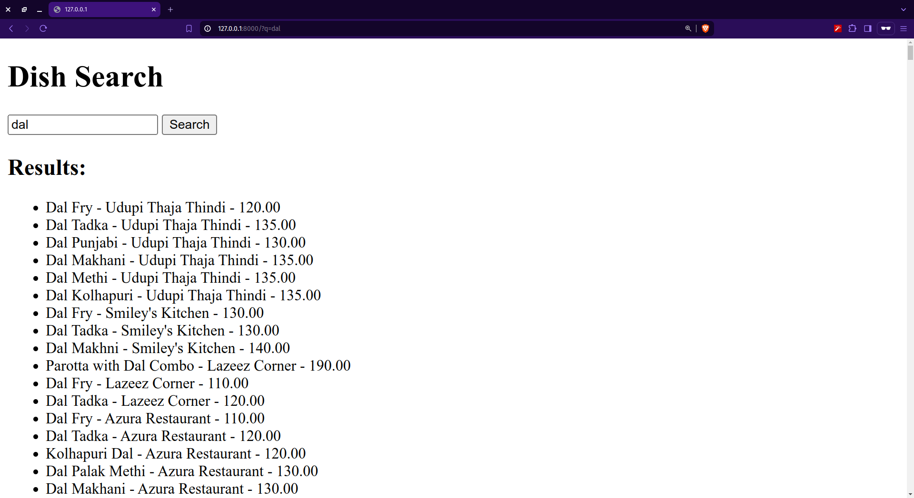

# A Django based application to search Food

To load data from `restaurant_search/restaurants_small.csv`, run:

```bash
cd restaurant_search/
python manage.py makemigrations
python manage.py migrate
python manage.py import_data
```



To run the code:

```bash
python manage.py runserver
```
